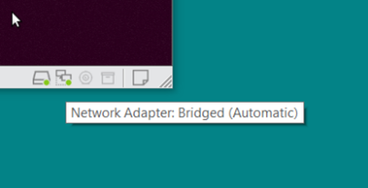
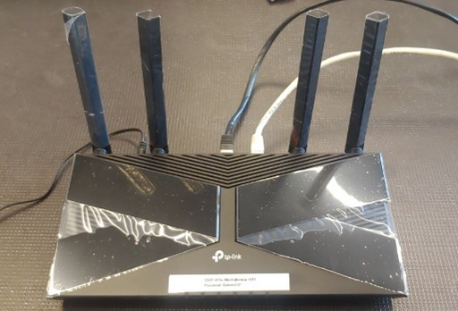
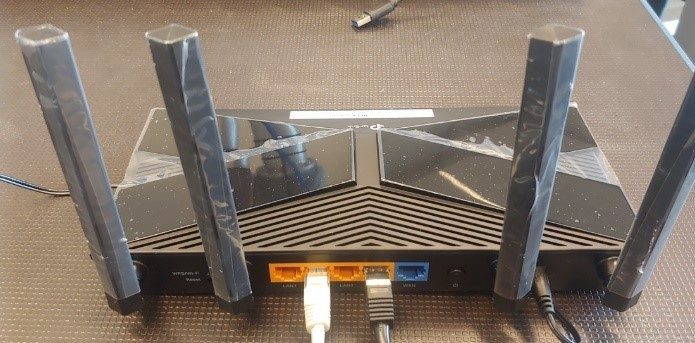

# uFactory Lite6 Robot Setup (ROS-Melodic versie)

In dit document is beschreven hoe de basis ROS software voor een uFactory Lite6 robot kan worden geïnstalleerd.

Voorbereiding
Voorafgaand aan deze setup dient het volgende geïnstalleerd te zijn:
* Ubuntu Bionic Beaver (18.04)
* ROS Melodic
* ROS Base Packages

*Let op: Volg nauwkeurig de instructies in de volgorde hier gegeven. Een verkeerde volgorde of het overslaan van handeling kan ervoor zorgen dat je setup van de uFactory Lite6 robot niet werkt!*

## Development-computer

Als in dit document gesproken wordt over een development-computer dan wordt hiermee bedoeld de laptop/computer waarop je de software in ROS ontwikkelt.

## Maken van de workspace
```bash
mkdir $HOME/ufactory_ws
mkdir $HOME/ufactory_ws/src
cd $HOME/ufactory_ws/src
git clone https://github.com/AvansMechatronica/my_xarm_lite6.git
```
Opmerking: Je kunt de packages uit de gekloonde github repository gebruiken als template voor je eigen applicatie/project. De wijze van de package modificeren is verderop in dit document beschreven.

## Installeren van benodigde packages
```bash
cd $HOME/ufactory_ws/src/ my_xarm_lite6/install
./install.bash
```

## Bouwen van de workspace
```bash
cd $HOME/ufactory_ws/
catkin b
```
p.s. als het bouwen niet goed lukt kun je het bouwen nogmaals starten door het “catkin b” commando (maximaal nog 1 keer extra proberen).

## ROS Environment setup
```bash
echo "source ~/ufactory_ws/devel/setup.bash" >> ~/.bashrc
source ~/.bashrc
```
Je hoeft dit maar 1-malig te doen

## Testen setup zonder fysieke robot
```bash
roslaunch my_lite6_moveit_config demo.launch
```

## Virtuele machine in Netwerk-connection selecteren
Bij gebruik van virtuele-machine op development-computer, dient het netwerk is als “bridge” geconfigureerd te zijn. Glijd met je muis over de icoontjes, linksonder van de virtuele machine, totdat je “Network Adapter” zie verschijnen. Het type dient Bridged te zijn. Zie Afbeelding.



Als dit niet het geval is click dan op het Network Adapter icoontje en selecteer “Settings”. Selecteer in het keuzemenu de optie “Bridged”.


## Maken verbinding tussen development-computer en de uFactoryLite6 robot
Verbind je development-computer met de uFactory Lite6 robot door middel van een CAT5-kabel en een router.




Gebruik alleen de oranje poorten, bijvoorbeeld:
* Poort 1 naar de uFactory Lite6 robot
* Poort 2 naar de development-computer

Ps. De router dient geconfigureerd te zijn voor het subnet 192.168.1.x. Meestal is dat het geval, wanneer dit niet het geval is dien je de router opnieuw te configureren. Zoek op internet de juiste handleiding van de router en volg de instructies hiervan om de router te configureren. Indien nodig doe een systeem-reset met de resetknop van de router.
 
*Let op: Gebruik geen WiFI naar de router, dit type verbindingen werken niet goed met een virtuele machine en een uFactory Lite6 robot.*

## Robot voorbereiden, na transport
Alvorens je de robot in ROS kunt gebruiken/aansturen dien je hem uit de transport stand te halen. Je kunt dit doen met een web-browser onder zowel windows als Linux/Ubuntu.
Open in de web-browser adres:
```
<robot-ip>:18333
```
bv.
```
192.168.2.12:18333
```

*Note: `<ip-adres>` = Ip-adres op sticker achter op de robot.*

Met de web-interface kun je dan de robot naar een begin/home positie handmatig bewegen.

Voordat je de robot wilt transporteren of inpakken dien je met deze web-interface de robot in de transport positie te plaatsen.

## Verbinding maken met de uFactoryLite6 robot & starten RVIZ

In terminal op development-computer:
```bash
roslaunch my_demo environment.launch robot_ip:=<ip-adres>
```
`<ip-adres>` = Ip-adres op sticker achter op de robot.

Dit commando start tevens de move-group node.
Je kunt nu de robot bedienen vanuit RVIZ of je eigen geschreven software op de development-computer.

*Let op: Voor je project dien je het volgende commando uit te voeren(bovenstaande applicatie is dan afgesloten).*
```bash
roslaunch my_lite6_moveit_config realMove_exec.launch robot_ip:=<ip-adres>
```
## Reset van de robot
Als de robot op enigerlei wijze in een fout toestand komt kun je het volgende commando gebruiken om de robot te resetten.
```bash
rosservice call /ufactory/moveit_clear_err
```
*Let op: Dit commando werkt alleen als de move-group node is opgestart.*

## Robot description
De URDF-beschrijving van de robot kun je vinden in de volgende map:
__$HOME/ufactory_ws/src/my_xarm_lite6/my_lite6_description/urdf/__

In het bestand *“lite6_robot_urdf.xacro”* kun je eigen modellen aan de robot toevoegen.

## Robot MoveIt-configuratie
```bash
roslaunch my_lite6_moveit_config setup_assistant.launch
```
Plaats van het “lite6_robot.srdf” bestand:

__$HOME/ufactory_ws/src/my_xarm_lite6/my_lite6_moveit_config/config__

Hierin kun je de configuratie van de robot bekijken en eventuele nieuwe “group_state” (robot_pose) aanmaken. Uiteraard kun je dit ook met de setup_assistant doen.

*p.s Als je extra gripper group_state hebt aangemaakt met de moveIt asssitant dan dien je in deze group_states de joints met de naam “gripper_sub” te verwijderen.*

*Pas op: Gebruik de setup_assistant alleen voor het toevoegen van nieuwe “group_states” of het maken van een nieuwe collision matrix. Verander geen controller instellingen!!!*

## Plaats eigen packages
Je kunt eigen packages of packages van derden onder brengen in de map:

__$HOME/ufactory_ws/src/my_xarm_lite6__

Vergreet niet de packages te bouwen en te sourcen (gebeurt automatisch bij het openen van een terminal)

## Backup van je project
Maak regelmatig een backup van je project. Je kunt dit door bijvoorbeeld een repository aan te maken bij Github.com. Dit maakt het je ook makkelijk om jullie werk met je groep te delen.

Alleen de bestanden in de volgende map zijn voor een backup van belang:

__$HOME/ufactory_ws/src/my_xarm_lite6__

*p.s. Voordat je github gaat gebruiken moet je eenmalig het volgende commando uitvoeren (dit verwijdert de oude repository van AvansMechatronica uit je workspace).*
```bash
rm -f -r $HOME/ufactory_ws/src/my_xarm_lite6/.git
```
Uitleg van Github valt buiten de lesstof.

## Controle van .bashrc
In het bestand *$HOME/.bashrc* wordt de ROS environment van de ros workspace geactiveerd  door het *“source ./ufactory_ws/devel/setup.bash”* commando. Het kan zijn dat dit meerdere keren in het bestand voor komt. Je kunt dit controleren door het bestand te bekijken.
```bash
gedit $HOME/.bashrc
```
Ga naar het einde van het bestand en verwijder elke “source” regel(duplicaten) die meerdere keren voor komt. Sla daarna het bestand op en sluit alle terminals alvorens je verder gaat.


# Demonstratie programma’s
### Python
In de git-hub repostory is een Python voorbeeldprogramma opgenomen in de package my_demo. Start daarvoor de robot eerst op volgens bovenstaande procedure. Je kunt de demosteratie-programma als volgt opstarten:
```bash
rosrun my_demo demo.py
```
 
Je kunt dit python programma gebruiken als inspiratiebron voor je eigen code.

### C++/FlexBe
In het document MoveItDemonstator worden een tweetal geavanceerde demonstratie programma’s beschreven:
* C++ applicatie: gebouwd in object georiënteerde programmeertaal C++
* FlexBE, applicatie: gebouwd met een grafische statemachine editor, Python kennis is vereist
Tevens worden hier een tweetal templates gepresenteerd die gebruikt kunnen worden als uitgangspunt voor een zelf te schrijven programma.


# Eigen programma’s
In het document MoveItExample worden templates beschreven waarin je een FlexBE of C++ programma kunt maken.

# Nadere informatie
Raadplaag de volgende sites voor meer informatie:

* [arm_ros](https://github.com/xArm-Developer/xarm_ros)
    * *Let op: De beschrijving van commando’s is in de “xarm” namespace. In “onze” configuratie is de namespace “ufactory”*

* [uFactoryLite 6](https://www.ufactory.cc/lite-6-collaborative-robot/)

